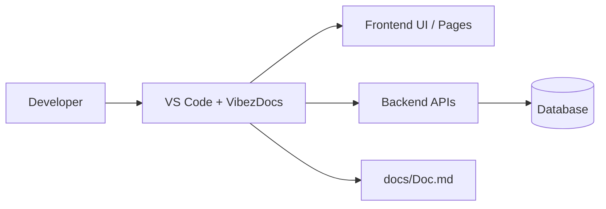

# VibezDocs

## Architecture
- backend unknown activity detected in SmartFines/backend/pom.xml
- backend unknown activity detected in SmartFines/frontend/.env
- • Updated the .env file in SmartFines/frontend to remove a duplicate VITE_API_URL entry.
- • The updated VITE_API_URL now points to http://localhost:8150/api.

## APIs
- API change in SmartFines/backend/src/main/java/com/slpolice/smartfine/controller/AuthController.java: package com.slpolice.smartfine.controller;

## Components
- Component update in SmartFines/backend/src/main/java/com/slpolice/smartfine/repository/UserRepository.java: package com.slpolice.smartfine.repository;

## Database
- Table users defined in SmartFines/database/init.sql

## Pages
- Page/routing change in SmartFines/frontend/src/routes/ProtectedRoute.jsx: import { Navigate } from 'react-router-dom'

## Development Timeline
- 2026-05-10T08:09:17.794Z: Updated in SmartFines/backend/pom.xml (unknown)
- 2026-05-10T15:40:09.876Z: Updated in SmartFines/frontend/.env (unknown)

## C4 Diagram (Mermaid format)

